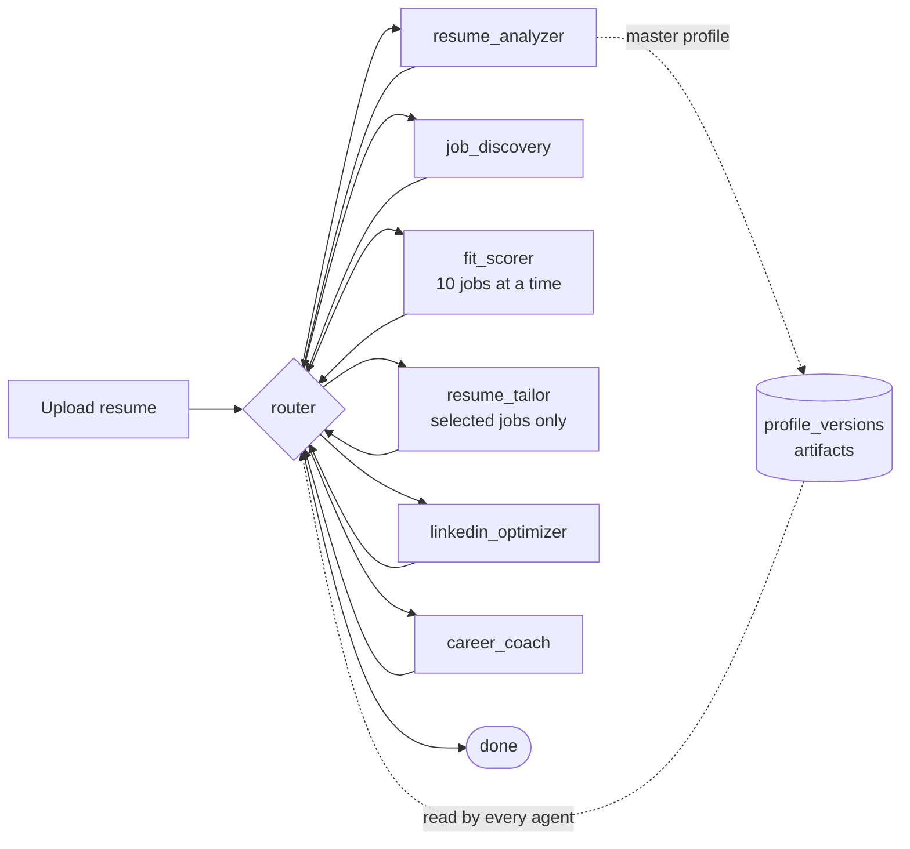

# Architecture

Kept current per CLAUDE.md: update this file whenever a component is added.

## Components

| Component | Where | Status |
|---|---|---|
| Config (pydantic-settings, `.env`) | `backend/app/core/config.py` | Phase 0 |
| Health endpoint `GET /health` | `backend/app/api/health.py` | Phase 0 |
| Master profile model | `backend/app/schemas/profile.py` | Phase 0 |
| CI (ruff + pytest on Python 3.11) | `.github/workflows/ci.yml` | Phase 0 |
| DB models: `profiles`, `profile_versions`, `llm_cache` | `backend/app/db/models.py` | Phase 1 |
| Migrations (Alembic) | `backend/app/db/migrations/` | Phase 1 |
| Repositories and LLM response cache | `backend/app/db/repositories.py` | Phase 1 |
| LLM client: JSON repair, one validation retry, content-hash cache; Anthropic or Google Gemini via `LLM_PROVIDER` | `backend/app/core/llm.py` | Phase 1 |
| Resume text extraction (PDF, DOCX, TXT; in memory, 5 MB cap) | `backend/app/core/resume_text.py` | Phase 2 |
| Resume Analyzer agent | `backend/app/agents/resume_analyzer/` | Phase 2 |
| Profile API: upload, read, delete-my-data | `backend/app/api/profiles.py` | Phase 2 |
| Per-IP rate limit, PII-redacting log filter | `backend/app/core/rate_limit.py`, `logging.py` | Phase 2 |
| Sample candidate (demo data and test fixtures) | `backend/app/sample/` | Phase 2 |
| `artifacts` table: every agent output, keyed by (profile, kind, ref) | `backend/app/db/models.py` | Phase 2 |
| Job sources: Remotive, Greenhouse boards, JSearch | `backend/app/agents/job_discovery/sources.py` | Phase 3 |
| Job Discovery agent: query plan, code prefilter, normalise, no-invention guard | `backend/app/agents/job_discovery/agent.py` | Phase 3 |
| Jobs API: discover, paste a description, list | `backend/app/api/jobs.py` | Phase 3 |
| Fit scorer agent: six weighted dimensions, cap and band in code, 10 jobs at a time | `backend/app/agents/fit_scorer/` | Phase 4 |
| Fit API: scores cached per (profile version, job) | `backend/app/api/jobs.py` | Phase 4 |
| Resume Tailor: writer call, deterministic guard, adversarial validator call | `backend/app/agents/resume_tailor/` | Phase 5 |
| Resume template and renderer (Jinja2, WeasyPrint, one-page fit) | `backend/app/templates/resume.html`, `backend/app/core/render.py` | Phase 5 |
| Tailor API: run, read with original for diff, HTML preview, PDF | `backend/app/api/tailor.py` | Phase 5 |
| Deployment: Docker image, Render blueprint, CORS for the frontend origin | `backend/Dockerfile`, `render.yaml` | Phase 5 |
| Shared no-fabrication checks (numbers, skills, softeners) | `backend/app/core/guard.py` | Phase 7 |
| LinkedIn Optimizer agent: copy-paste text only | `backend/app/agents/linkedin_optimizer/` | Phase 7 |
| Credentials agent: propose, user confirms, new profile version | `backend/app/agents/credentials/`, `backend/app/core/profile_ops.py` | Phase 7 |
| Career Coach agent: one plan across all fit reports | `backend/app/agents/career_coach/` | Phase 8 |
| Orchestrator: LangGraph state machine, model router guarded by code | `backend/app/agents/orchestrator/` | Phase 8 |
| Runs and Server-Sent Events progress | `backend/app/core/runs.py`, `backend/app/api/runs.py` | Phase 8 |
| Pipeline steps shared by API routes and graph nodes | `backend/app/services.py` | Phase 8 |
| Frontend: design tokens, landing, app shell | `frontend/app/globals.css`, `frontend/components/landing.tsx`, `frontend/app/(app)/layout.tsx` | Phase 6 |
| Frontend pages: dashboard, resume, jobs, job detail, tailor, LinkedIn, certifications, coach, settings | `frontend/app/(app)/` | Phase 6 |
| Live agent stepper (Server-Sent Events), score ring, resume diff | `frontend/components/` | Phase 6 |

## Frontend

Next.js 14 App Router, TypeScript and Tailwind. Every colour is a CSS variable in
`frontend/app/globals.css`; Tailwind class names are aliases for those variables, so no
component hardcodes a colour and both themes come from one file. Band colours exist twice:
a bright one for rings and fills, and a darker `-fg` one that passes WCAG AA as text.

The browser keeps one profile id in local storage (`sample` until a resume is uploaded) and
talks to the backend directly at `NEXT_PUBLIC_API_URL`. There is no server-side data
fetching and no frontend state library: each page loads what it shows.

Components in `frontend/components/ui/` follow shadcn/ui conventions (`cn`, `cva`, Radix
`Slot`) and were written by hand to keep the set small; `components.json` is present, so
`npx shadcn add <component>` works when more are needed.

Motion is limited to transform and opacity, 200 to 600 ms, and is replaced by instant state
changes under `prefers-reduced-motion`.

## How a run is orchestrated

- The graph is a LangGraph `StateGraph`: one node per agent plus a router. Every agent
  returns to the router.
- The router first works out, in code, which agents have their inputs right now (the
  `needs:` column of the orchestrator prompt). Only if more than one is runnable does it
  ask the orchestrator model to choose. An answer outside the runnable set, or no answer,
  falls back to pipeline order. The model can reorder a run; it cannot break one.
- An agent that raises is retried once. A second failure marks that branch degraded and
  the run continues. An agent whose inputs can never arrive is reported as skipped.
- Before and after every agent call the run emits `{agent, status, detail}`. The frontend
  reads these from `GET /api/runs/{id}/stream` (Server-Sent Events; event ids allow resume).
- `resume_tailor` runs only for job ids the user selected. `credentials` is outside the
  graph: it needs a credential and the user's confirmation, so it has its own endpoints.

## How a new certificate flows through

1. `POST /credentials` reads the file, link or statement and returns a proposal. Code sets
   the id, decides `verified` (true only if a credential id or URL was actually supplied),
   detects duplicates, writes the confirmation sentence and builds LinkedIn's pre-filled
   add-certification link. The link the user gives is never fetched.
2. Nothing is written until `POST /credentials/{id}/confirm`.
3. Confirming stores profile version N+1 with a `change_log` entry, deletes tailored resumes
   and the coaching plan, and leaves fit reports and LinkedIn copy stale (they are keyed by
   profile version). The next tailoring run uses the new profile.

## How tailoring stays honest

1. The tailor writes content JSON only. Employers, titles, dates, education and
   certifications are never in its output; the renderer reads them from the profile.
2. Code checks what code can prove: every id exists, every skill names a profile skill,
   every number already appears in the profile (or is the computed experience length), and
   no claim is softened with "familiar with". A failure is fed back once.
3. A second model call, with a different prompt, labels every claim SUPPORTED, REWORDED,
   OVERSTATED or UNSUPPORTED. Code derives the verdict from those labels.
4. On a fail the tailor is re-run once with the findings. A second fail returns the
   untailored resume with the reason. The user never receives an unvalidated rewrite.
5. If the rendered page overflows, the tailor is asked once for a tighter cut; after that
   code removes the least relevant trailing content, which cannot add a claim.

## How job discovery works

1. The model expands target roles into 8-15 queries (phase 1 of its prompt).
2. Code fetches every source. Feeds (Remotive, Greenhouse) are fetched whole, cached for six
   hours and filtered by title against the queries; JSearch is a search API with a quota, so
   it receives at most five queries per run and is skipped when `RAPIDAPI_KEY` is empty.
3. Code drops what needs no judgement: older than 45 days, excluded companies, exact
   duplicates, titles above an entry-level band. The newest 30 survivors go on.
4. The model merges fuzzy duplicates, drops spam and location mismatches, and extracts
   must-haves, stack, years and salary (phase 2).
5. Code rejects any job whose URL was not fetched, copies title, company, location and date
   from the source rather than the model, and blanks a salary whose digits are not in the
   posting.

A source that fails is listed under `dropped` and the run continues.

## How an agent call works

1. The agent builds a JSON input and calls `LLM.complete(system_prompt, inputs, Schema)`.
2. The response is repaired (fences, stray prose, trailing commas) and validated against the
   agent's Pydantic schema. Semantic rules, such as "every skill cites evidence that exists",
   are validators on that schema.
3. A failure is sent back to the model once with the validation error. A second failure raises
   `LLMError`, which the API turns into a 502. Error text names positions, never content.
4. A valid result is cached under `sha256(model, system, input)`.

Code, not the model, owns ids, versions, timestamps, provenance and arithmetic.

## Data model

- `profiles` holds one row per candidate with an `expires_at`. NULL means the sample profile.
- `profile_versions` holds an immutable master-profile JSON snapshot per `(profile_id, version)`.
  Every change is a new row, so any change can be reversed.
- `llm_cache` maps `sha256(model, system prompt, input)` to the validated response, tagged with
  the profile it was computed for so a purge removes derived data too.

SQLite is the zero-config default for local runs; set `DATABASE_URL` for Postgres (Supabase).

`backend/app/schemas/profile_schema.json` is the example instance from the build pack.
`profile.py` is the enforced contract; a test fails if the two drift apart.

## Licensed job sources (CLAUDE.md rule 4: no scraping)

| Source | Covers | Access |
|---|---|---|
| JSearch (RapidAPI) | Google for Jobs feed, incl. LinkedIn and Indeed postings | Free tier, API key |
| Adzuna | Broad aggregator, India and global | Free app id and key |
| Remotive, RemoteOK, We Work Remotely | Remote-first roles | Public JSON, no key |
| Greenhouse, Lever, Ashby boards | Direct company career pages | Public JSON per company |
| Paste-a-link or paste-JD | Anything else, incl. Naukri | User-supplied |

Wired so far: Remotive, Greenhouse, JSearch and pasted descriptions. Remotive's terms require
a link back to the Remotive URL and naming Remotive as the source, and ask for at most about
four fetches a day; the job card links to the source URL and shows the source name, and the
feed is cached for six hours.
